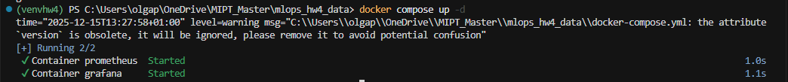
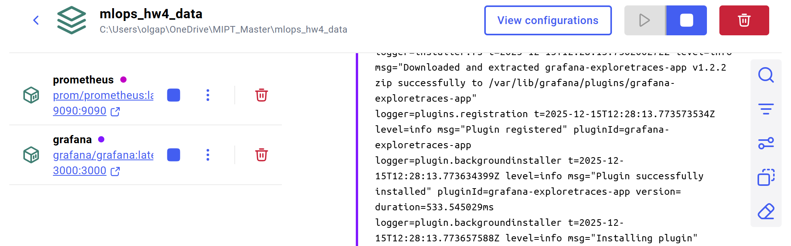
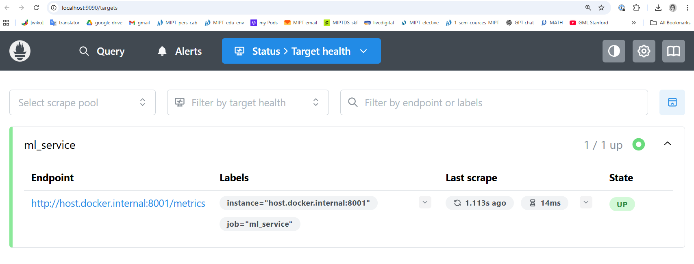
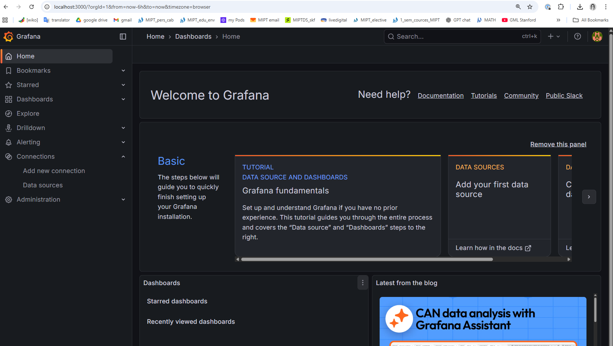
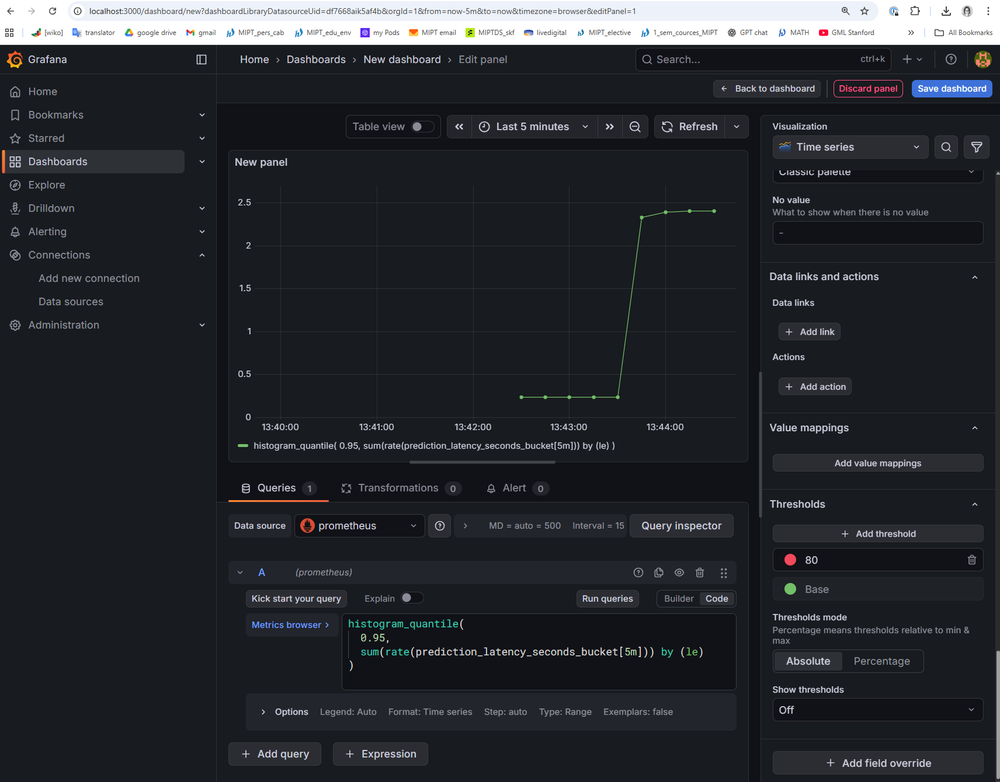
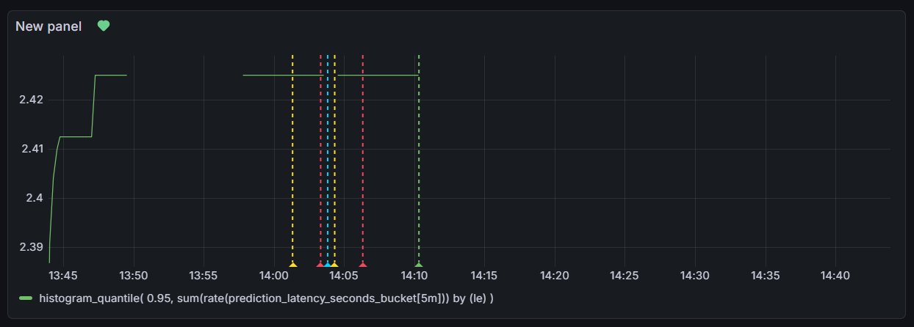
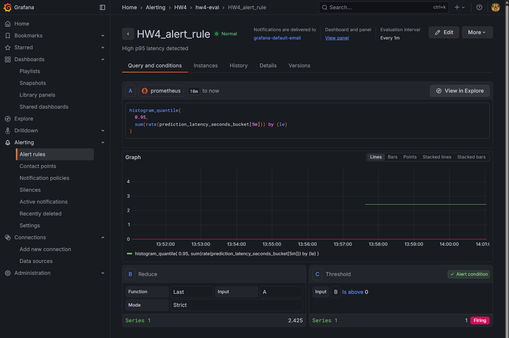
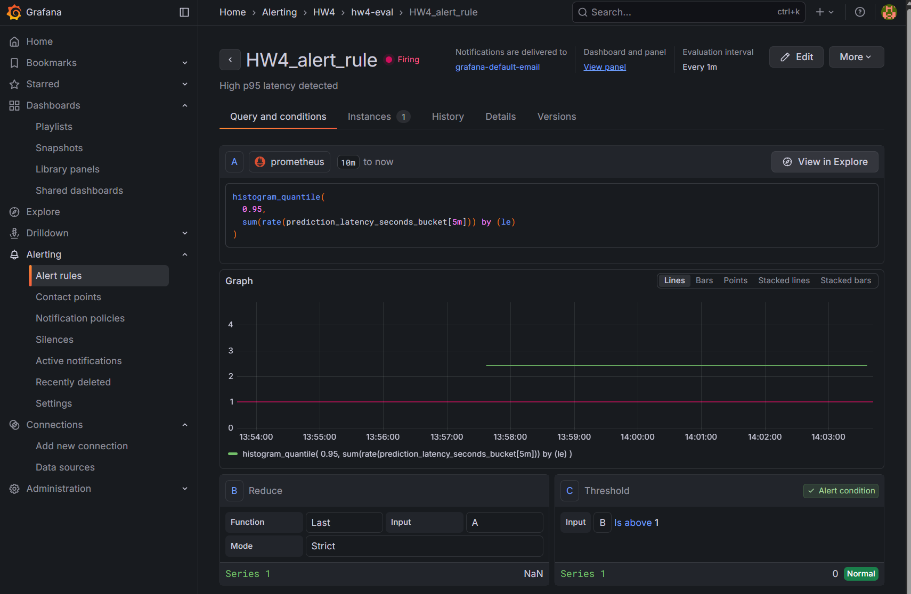
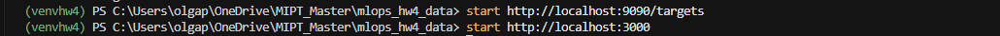

# HW4 — Настройка алертинга в Grafana при нарушении SLO


## Цель работы

- Развернуть систему наблюдаемости (Prometheus + Grafana)
- Определить SLO для ML-сервиса
- Настроить алерт при нарушении SLO
- Проверить корректность срабатывания алерта

---

## Стек технологий

- Python 3.11
- FastAPI
- Prometheus
- Grafana
- Docker / Docker Compose

---

## Определение SLO

**Service Level Objective (SLO):**

> p95 latency инференса модели должна быть **меньше 1 секунды**

---

## Используемая метрика

В сервисе реализована Prometheus-метрика типа **Histogram**:

```text
prediction_latency_seconds
````

Метрика используется для расчёта p95 latency с помощью PromQL:

```promql
histogram_quantile(
  0.95,
  sum(rate(prediction_latency_seconds_bucket[5m])) by (le)
)
```

---

## Alert rule

Алерт срабатывает, если:

* p95 latency > **1 секунды**
* условие сохраняется более **1 минуты**
* проверка выполняется **каждую минуту**

Алерт настроен через **Grafana UI** с использованием Unified Alerting.

---

## Grafana Dashboard

В Grafana создан дашборд:

* отображает p95 latency инференса модели
* использует Prometheus как источник данных

Дашборд был создан через UI и экспортирован в JSON.

Файл:

```text
grafana/dashboard.json
```

---

## Скриншоты

Скриншоты, подтверждающие корректную работу системы:

### 1. Запуск Docker контейнеров

Запуск Prometheus и Grafana через `docker compose up -d`:



Docker Desktop с запущенными контейнерами prometheus и grafana:



---

### 2. Prometheus

Prometheus targets — ML-сервис успешно подключен и имеет статус **UP**:



---

### 3. Grafana — начальная страница

Главная страница Grafana после успешного запуска:



---

### 4. Настройка PromQL запроса

Редактирование панели дашборда с PromQL запросом для расчёта p95 latency:



---

### 5. Grafana Dashboard

Дашборд с графиком p95 latency инференса модели (значение ~2.42 секунды превышает SLO):



---

### 6. Alert Rule — конфигурация

Настройка алерта `HW4_alert_rule` с условием срабатывания при p95 > 1 секунды:



---

### 7. Alert в состоянии Firing

Алерт перешёл в состояние **Firing** после генерации нагрузки с высокой задержкой:



---

### 8. Открытие Prometheus и Grafana

Команды для открытия веб-интерфейсов Prometheus и Grafana в браузере:



---

## Как запустить проект

### 1. Запуск Prometheus и Grafana

```bash
docker compose up -d
```

* Prometheus: [http://localhost:9090](http://localhost:9090)
* Grafana: [http://localhost:3000](http://localhost:3000)

---

### 2. Запуск ML-сервиса

Активировать виртуальное окружение и запустить сервис:

```bash
uvicorn src.main:app --host 0.0.0.0 --port 8000
```

---

### 3. Генерация нагрузки (для проверки алерта)

```powershell
1..30 | % { iwr "http://localhost:8000/predict?delay=2" -UseBasicParsing | Out-Null }
```

После этого алерт переходит в состояние **Firing**.

---

##  Структура репозитория

```text
MLOPS_HW4_DATA/
├── docker-compose.yml
├── prometheus.yml
├── src/
│   └── main.py
├── grafana/
│   └── dashboard.json
├── screenshots/
│   ├── dashboard.png
│   ├── docker_run.png
│   ├── docker_run_2.png
│   ├── grafana.png
│   ├── grafana_alert_rule.png
│   ├── grafana_alerts.png
│   ├── grafana_query.png
│   ├── prom_grap_request.png
│   └── prometheus.png
├── venvhw4/
└── README.md
```


